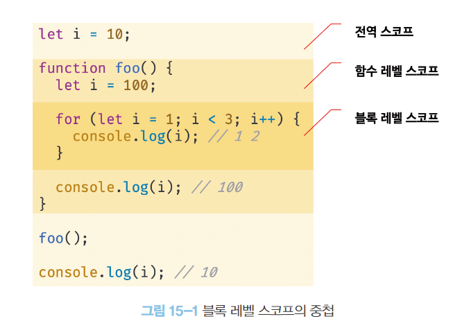
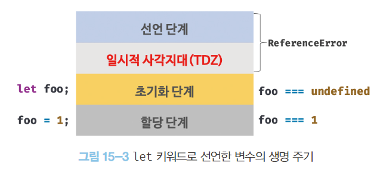

# var 키워드로 선언한 변수의 문제점

## 1. 변수 중복 선언 허용

var 키워드로 선언한 변수는 중복 선언이 가능하다.

동일한 이름의 변수가 이미 선언되어 있는 것을 모르고 변수를 중복 선언하면 의도치 않은 결과를 가질 수 있다.

```jsx
var x = 1;
var y = 1;

// var 키워드로 선언된 변수는 같은 스코프 내에서 중복 선언을 허용한다.
// 초기화문이 있는 변수 선언문은 자바스크립트 엔진에 의해 var 키워드가 없는 것처럼 동작한다.
var x = 100;
// 초기화문이 없는 변수 선언문은 무시된다.
var y;

console.log(x); // 100
console.log(y); // 1
```

## 2. 함수 레벨 스코프

var 키워드로 선언한 변수는 오로지 함수의 코드 블록만을 지역 스코프로 인정한다.

따라서 함수 외부에서 var 키워드로 선언한 변수는 코드 블록 내에서 선언해도 모두 전역 변수가 된다.

```jsx
var x = 1;

if (true) {
  // x는 전역 변수다. 이미 선언된 전역 변수 x가 있으므로 x 변수는 중복 선언된다.
  // 이는 의도치 않게 변수값이 변경되는 부작용을 발생시킨다.
  var x = 10;
}

console.log(x); // 10
```

```jsx
var i = 10;

// for문에서 선언한 i는 전역 변수이다. 이미 선언된 전역 변수 i가 있으므로 중복 선언된다.
for (var i = 0; i < 5; i++) {
  console.log(i); // 0 1 2 3 4
}

// 의도치 않게 i 변수의 값이 변경되었다.
console.log(i); // 5
```

## 3. 변수 호이스팅

변수 호이스팅에 의해 var 키워드로 선언한 변수는 변수 선언문 이전에 참조할 수 있다. (언제나 undefined 반환)

에러를 발생시키지는 않지만 프로그램 흐름에 맞지 않을 뿐더러 가독성을 떨어뜨리고 오류를 발생시킬 여지를 남긴다.

---

# let 키워드

var 키워드의 단점을 보완하기 위해 ES6에 새롭게 도입된 변수 선언 키워드이다.

## 1. 변수 중복 선언 금지

같은 이름의 변수를 중복 선언하면 문법 에러(SyntaxError)가 발생한다.

```jsx
var foo = 123;
// var 키워드로 선언된 변수는 같은 스코프 내에서 중복 선언을 허용한다.
// 아래 변수 선언문은 자바스크립트 엔진에 의해 var 키워드가 없는 것처럼 동작한다.
var foo = 456;

let bar = 123;
// let이나 const 키워드로 선언된 변수는 같은 스코프 내에서 중복 선언을 허용하지 않는다.
let bar = 456; // SyntaxError: Identifier 'bar' has already been declared
```

## 2. 블록 레벨 스코프

let 키워드로 선언한 변수는 모든 코드 블록(함수, if, for, while, try/catch)을 지역 스코프로 인정하는 블록 레벨 스코프를 따른다.

```jsx
let foo = 1; // 전역 변수

{
  let foo = 2; // 지역 변수
  let bar = 3; // 지역 변수
}

console.log(foo); // 1
console.log(bar); // ReferenceError: bar is not defined
```

함수도 코드 블록이므로 스코프를 만든다. 함수 내의 코드 블록은 함수 레벨 스코프에 중첩된다.



## 3. 변수 호이스팅

```jsx
console.log(foo); // ReferenceError: foo is not defined
let foo;
```

let 키워드로 선언한 변수를 변수 선언문 이전에 참조하면 참조 에러(ReferenceError)가 발생한다.

var 키워드로 선언한 변수는 런타임 이전에 암묵적으로 “선언 단계”와 “초기화 단계”가 한번에 진행된다. 이후 변수 할당문에 도달하면 값이 할당된다.


**let 키워드로 선언한 변수는 “선언 단계”와 “초기화 단계”가 분리되어 진행된다.**

즉, 런타임 이전에 암묵적으로 선언 단계가 먼저 실행되지만 초기화 단계는 변수 선언문에 도달했을 때 실행된다.

초기화 단계 이전에 변수에 접근하려고 하면 참조 에러가 발생한다.

스코프의 시작 지점부터 초기화 시작 지점까지 변수를 참조할 수 없는 구간을 <strong>일시적 사각지대(Temporal Dead Zone: TDZ)</strong>라고 부른다.

```jsx
// 런타임 이전에 선언 단계가 실행된다. 아직 변수가 초기화되지 않았다.
// 초기화 이전의 일시적 사각 지대에서는 변수를 참조할 수 없다.
console.log(foo); // ReferenceError: foo is not defined

let foo; // 변수 선언문에서 초기화 단계가 실행된다.
console.log(foo); // undefined

foo = 1; // 할당문에서 할당 단계가 실행된다.
console.log(foo); // 1
```



```jsx
let foo = 1; // 전역 변수

{
  console.log(foo); // ReferenceError: Cannot access 'foo' before initialization
  let foo = 2; // 지역 변수
}
```

let 키워드로 선언한 변수의 경우 변수 호이스팅이 발생하지 않는 것처럼 보이지만 그렇지 않다.

변수 호이스팅이 발생하지 않았다면 전역 변수 foo의 값이 출력 되었을 것이다.

그러나 호이스팅이 발생하기 때문에 참조 에러가 발생한다.

## 4. 전역 객체와 let

var 키워드로 선언한 전역 변수와 전역 함수, 그리고 선언하지 않은 변수에 값을 할당한 암묵적 전역은 전역 객체 window의 프로퍼티가 된다.

그러나 let 키워드로 선언한 전역 변수는 전역 객체의 프로퍼티가 아니다.

```jsx
// 이 예제는 브라우저 환경에서 실행해야 한다.
let x = 1;

// let, const 키워드로 선언한 전역 변수는 전역 객체 window의 프로퍼티가 아니다.
console.log(window.x); // undefined
console.log(x); // 1
```

---

# const 키워드

const 키워드는 상수를 선언하기 위해 사용한다. (반드시 그런 것은 아님)

## 1. 선언과 초기화

**const 키워드로 선언한 변수는 반드시 선언과 동시에 초기화해야 한다.**

```jsx
const foo; // SyntaxError: Missing initializer in const declaration
```

const 키워드로 선언한 변수는 let 키워드로 선언한 변수와 마찬가지로 블록 레벨 스코프를 가지며 변수 호이스팅이 발생하지 않는 것처럼 동작한다.

```jsx
{
  // 변수 호이스팅이 발생하지 않는 것처럼 동작한다
  console.log(foo); // ReferenceError: Cannot access 'foo' before initialization
  const foo = 1;
  console.log(foo); // 1
}

// 블록 레벨 스코프를 갖는다.
console.log(foo); // ReferenceError: foo is not defined
```

## 2. 재할당 금지

**const 키워드로 선언한 변수는 재할당이 금지된다.**

```jsx
const foo = 1;
foo = 2; // TypeError: Assignment to constant variable.
```

## 3. 상수

const 키워드로 선언한 변수에 원시 값을 할당한 경우 변수 값을 변경할 수 없다.

원시 값은 변경 불가능한 값이므로 재할당 없이 값을 변경할 수 있는 방법이 없기 때문이다.

이러한 특징을 이용해 const 키워드를 **상수(재할당이 금지된 변수)**를 표현하는 데 사용하기도 한다.

```jsx
// 세전 가격
let preTaxPrice = 100;

// 세후 가격
// 0.1의 의미를 명확히 알기 어렵기 때문에 가독성이 좋지 않다.
let afterTaxPrice = preTaxPrice + preTaxPrice * 0.1;

console.log(afterTaxPrice); // 110
```

```jsx
// 세율을 의미하는 0.1은 변경할 수 없는 상수로서 사용될 값이다.
// 변수 이름을 대문자로 선언해 상수임을 명확히 나타낸다.
const TAX_RATE = 0.1;

// 세전 가격
let preTaxPrice = 100;

// 세후 가격
let afterTaxPrice = preTaxPrice + preTaxPrice * TAX_RATE;

console.log(afterTaxPrice); // 110
```

## 4. const 키워드와 객체

const 키워드로 선언된 변수에 객체를 할당한 경우 값을 변경할 수 있다.

변경 불가능한 값인 원시 값은 재할당 없이 변경할 수 있는 방법이 없지만 변경 가능한 값인 객체는 재할당 없이도 직접 변경이 가능하기 때문이다.

```jsx
const person = {
  name: "Lee",
};

// 객체는 변경 가능한 값이다. 따라서 재할당없이 변경이 가능하다.
person.name = "Kim";

console.log(person); // {name: "Kim"}
```

const 키워드는 재할당을 금지할 뿐 “불변”을 의미하지는 않는다.

---

# var vs let vs const

- ES6를 사용한다면 var 키워드는 사용하지 않는다.
- 재할당이 필요한 경우에 한정해 let 키워드를 사용한다. 이때 변수의 스코프는 최대한 좁게 만든다.
- 변경이 발생하지 않고 읽기 전용으로 사용하는 원시 값과 객체에는 const 키워드를 사용한다.
