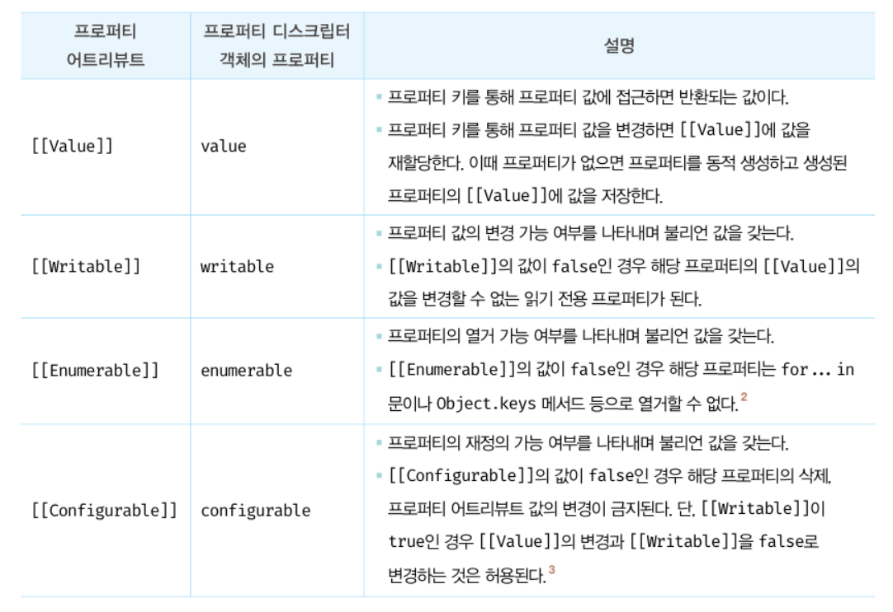
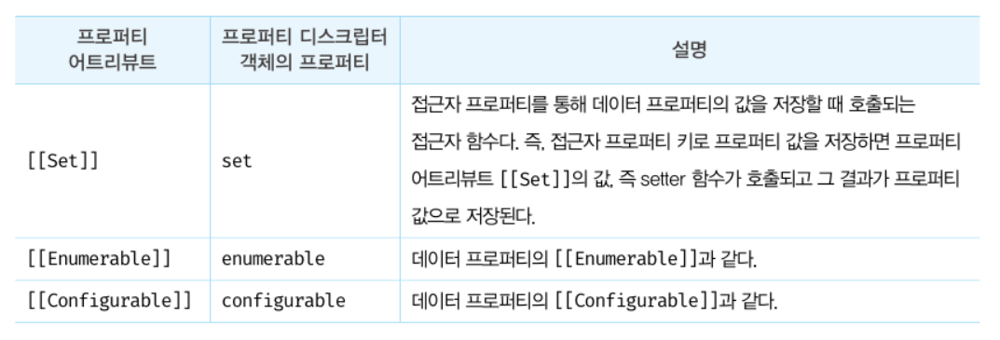

# 내부 슬롯과 내부 메서드

자바스크립트 엔진의 구현 알고리즘을 설명하기 위해 ECMAScript 사양에서 사용하는 <strong>의사 프로퍼티(내부 슬롯)</strong>와 **의사 메서드(내부 메서드)**

이중 괄호 **[[…]]** 로 감싸져 있다.

내부 슬롯과 내부 메서드는 자바스크립트 엔진에서 실제로 동작하는 내부 로직이지만, 내부 슬롯과 내부 메서드에 직접적으로 접근하거나 호출할 수 있는 방법을 제공하지 않는다.

그러나 일부 내부 슬롯과 내부 메서드에 한하여 간접적으로 접근할 수 있는 수단을 제공하기는 한다.

예) [[Prototype]] 내부 슬롯은 `__proto__` 를 통해 간접적으로 접근할 수 있다.

```jsx
const o = {};

o.[[Prototype]];  // Uncaught SyntaxError: Unexpected token '['

o.__proto__;  // Object.prototype
```

# 프로퍼티 어트리뷰트와 프로퍼티 디스크립터 객체

프로퍼티 어트리뷰트는 프로퍼티의 상태를 나타내며, 프로퍼티를 생성할 때 기본값으로 자동 정의된다.

### 프로퍼티의 상태?

- 프로퍼티의 값(value)
- 값의 갱신 가능 여부(writable)
- 열거 가능 여부(enumerable)
- 재정의 가능 여부(configurable)

프로퍼티 어트리뷰트는 자바스크립트 엔진이 관리하는 내부 상태 값(meta-property)인 내부 슬롯 <strong>[[Value]], [[Writable]], [[Enumerable]], [[Configurable]]</strong>이다.

내부 슬롯이기 때문에 프로퍼티 어트리뷰트에 직접 접근할 수 없지만 `Object.getOwnPropertyDescriptor` 메서드를 통해서 간접적으로 확인할 수는 있다.

```jsx
const person = {
  name: "Lee",
};

console.log(Object.getOwnPropertyDescriptor(person, "name"));
// { value: "Lee", writable: true, enumerable: true, configurable: true }
```

`Object.getOwnPropertyDescriptor` 메서드는

- 첫 번째 매개변수로 객체의 참조를 전달하고,
- 두 번째 매개변수로 프로퍼티 키를 전달한다.
- 프로퍼티 어트리뷰트 정보를 제공하는 **프로퍼티 디스크립터 객체**를 반환한다.

ES8에서 `Object.getOwnPropertyDescriptors` 메서드는 모든 프로퍼티의 프로퍼티 어트리뷰트 정보를 제공하는 프로퍼티 디스크립터 객체들을 반환한다.

```jsx
const person = {
  name: "Lee",
};

person.age = 20;

console.log(Object.getOwnPropertyDescriptors(person));
/*
{ 
	name: {value: "Lee", writable: true, enumerable: true, configurable: true },
  age: {value: 20, writable: true, enumerable: true, configurable: true },
}
*/
```

# 데이터 프로퍼티와 접근자 프로퍼티

- 데이터 프로퍼티 (data property)
  - 키와 값으로 구성된 일반적인 프로퍼티
- 접근자 프로퍼티 (accessor property)
  - 자체적으로는 값을 갖지 않고 다른 데이터 프로퍼티의 값을 읽거나 저장할 때 호출되는 접근자 함수로 구성된 프로퍼티

## 데이터 프로퍼티



프로퍼티가 생성될 때, [[Value]]의 값은 프로퍼티 값으로 초기화되며, [[Writable]], [[Enumerable]], [[Configurable]]은 true로 초기화된다.

## 접근자 프로퍼티




```jsx
const person = {
  firstName: "cozups",
  lastName: "Kim",

  // fullName은 접근자 함수로 구성된 접근자 프로퍼티
  // getter 함수
  get fullName() {
    return `${this.firstName}${this.lastName}`;
  },
  // setter 함수
  set fullName(name) {
    [this.firstName, this.lastName] = name.split(" ");
  },
};

// 데이터 프로퍼티를 통한 프로퍼티 값의 참조
console.log(person.firstName + " " + person.lastName); // cozups Kim

// 접근자 프로퍼티를 통한 프로퍼티 값의 저장
// 접근자 프로퍼티 fullName에 값을 저장하면 setter 함수가 호출된다.
person.fullName = "James Lee";
console.log(person); // { firstName: 'James', lastName: 'Lee' }

// 접근자 프로퍼티를 통한 프로퍼티 값의 참조
// 접근자 프로퍼티 fullName에 접근하면 getter함수가 호출된다.
console.log(person.fullName); // James Lee

// firstName은 데이터 프로퍼티
let descriptor = Object.getOwnPropertyDescriptor(person, "firstName");
console.log(descriptor);
// { value: "James", writable: true, enumerable: true, configurable: true }

// fullName은 접근자 프로퍼티
descriptor = Object.getOwnPropertyDescriptor(person, "fullName");
// {enumerable: true, configurable: true, get: ƒ, set: ƒ}
```

### 접근자 프로퍼티 fullName으로 프로퍼티 값에 접근하면…

1. 프로퍼티 키가 유효한지 확인한다. 프로퍼티 키는 문자열 또는 심벌이어야 한다. 프로퍼티 키 “fullName”은 문자열이므로 유효한 프로퍼티 키다.
2. 프로토타입 체인에서 프로퍼티를 검색한다. person 객체에 fullName 프로퍼티가 존재한다.
3. 검색된 fullName 프로퍼티가 데이터 프로퍼티인지 접근자 프로퍼티인지 확인한다. fullName 프로퍼티는 접근자 프로퍼티이다.
4. 접근자 프로퍼티 fullName의 프로퍼티 어트리뷰트 [[Get]]의 값 `getter` 함수를 호출하여 그 결과를 반환한다.

접근자 프로퍼티와 데이터 프로퍼티를 구별하는 방법은 프로퍼티 디스크립터 객체를 살펴보는 것이다. 접근자 프로퍼티와 데이터 프로퍼티의 프로퍼티 디스크립터 객체의 프로퍼티가 다르기 때문이다.

# 프로퍼티 정의

<aside>
💡 새로운 프로퍼티를 추가하면서 프로퍼티 어트리뷰트를 명시적으로 정의하거나, 기존 프로퍼티의 프로퍼티 어트리뷰트를 재정의 하는 것

</aside>

`Object.defineProperty` 메서드를 통해 프로퍼티 어트리뷰트를 정의할 수 있다.

```jsx
const person = {};

// 데이터 프로퍼티
Object.defineProperty(person, "firstName", {
  value: "cozups",
  writable: true,
  enumerable: true,
  configurable: true,
});

// 접근자 프로퍼티
Object.defineProperty(person, "fullName", {
  get() {
    return `${this.firstName} ${this.lastName}`;
  },
  set(name) {
    [this.firstName, this.lastName] = name.split(" ");
  },
  enumerable: true,
  configurable: true,
});
```

| 프로퍼티 디스크립터 객체 프로퍼티 | 대응하는 프로퍼티 어트리뷰트 | 생략했을 때의 기본 값 |
| --------------------------------- | ---------------------------- | --------------------- |
| value                             | [[Value]]                    | undefined             |
| get                               | [[Get]]                      | undefined             |
| set                               | [[Set]]                      | undefined             |
| writable                          | [[Writable]]                 | false                 |
| enumerable                        | [[Enumerable]]               | false                 |
| configurable                      | [[Configurable]]             | false                 |

`Object.defineProperty` 메서드는 한번에 하나의 프로퍼티만 정의할 수 있다.

`Object.defineProperties` 메서드를 사용하면 여러 개의 프로퍼티를 한 번에 정의할 수 있다.

```jsx
const person = {};

Object.defineProperties(person, {
  // 데이터 프로퍼티 정의
  firstName: {
    value: "cozups",
    writable: true,
    enumerable: true,
    configurable: true,
  },
  lastName: {
    value: "Kim",
    writable: true,
    enumerable: true,
    configurable: true,
  },
  // 접근자 프로퍼티 정의
  fullName: {
    get() {
      return `${this.firstName} ${this.lastName}`;
    },
    set(name) {
      [this.firstName, this.lastName] = name.split(" ");
    },
    enumerable: true,
    configurable: true,
  },
});

person.fullName = "James Lee";
console.log(person); // {firstName: 'James', lastName: 'Lee'}
```

# 객체 변경 방지

## 1. 객체 확장 금지

`Object.preventExtensions` 메서드는 객체의 확장을 금지한다.

객체 확장 금지란 **프로퍼티 추가 금지**를 의미한다.

즉, 프로퍼티 동적 추가와 Object.defineProperty 메서드로 추가하는 것이 금지된다.

확장이 가능한 객체인지 여부는 `Object.isExtensible` 메서드로 확인할 수 있다.

```jsx
const person = { name: "Kim" };

console.log(Object.isExtensible(person)); // true

// person 객체 확장 금지
Object.preventExtensions(person);

console.log(Object.isExtensible(person)); // false

person.age = 20; // 무시. strict mode에서는 에러
console.log(person); // { name: 'Kim' }

// 프로퍼티 추가는 금지되지만 삭제는 허용
delete person.name;
console.log(person); // {}

// 프로퍼티 정의에 의한 프로퍼티 추가도 금지된다.
Object.defineProperty(person, "age", { value: 20 });
// TypeError: Cannot define property age, object is not extensible
```

## 2. 객체 밀봉

`Object.seal` 메서드는 객체를 밀봉한다.

객체 밀봉이란 **프로퍼티 추가 및 삭제와 프로퍼티 어트리뷰트 재정의 금지**를 의미한다.

즉, 밀봉된 객체는 읽기와 쓰기만 가능하다.

밀봉된 객체인지 여부는 `Object.isSealed` 메서드로 확인할 수 있다.

```jsx
const person = { name: "Kim" };

console.log(Object.isSealed(person)); // false

// person 객체 밀봉
Object.seal(person);

console.log(Object.isSealed(person)); // true

console.log(Object.getOwnPropertyDescriptors(person));
/*
{
  name: {value: 'Kim', writable: true, enumerable: true, configurable: false},
}
*/

// 프로퍼티 추가 금지
person.age = 20; // 무시. strict mode에서는 에러
console.log(person); // { name: 'Kim' }

// 프로퍼티 삭제 금지
delete person.name; // 무시. strict mode에서는 에러
console.log(person); // { name: 'Kim' }

// 프로퍼티 값 갱신은 가능
person.name = "Lee";
console.log(person); // { name: 'Lee' }

// 프로퍼티 어트리뷰트 재정의 금지
Object.defineProperty(person, "name", { configurable: true });
// TypeError: Cannot redefine property: name
```

## 3. 객체 동결

`Object.freeze` 메서드는 객체를 동결한다.

객체 동결이란 **프로퍼티 추가 및 삭제와 프로퍼티 어트리뷰트 재정의 금지, 프로퍼티 값 갱신 금지**를 의미한다.

즉, 동결된 객체는 읽기만 가능하다.

동결된 객체인지 여부는 `Object.isFrozen` 메서드로 확인할 수 있다.

```jsx
const person = { name: "Kim" };

console.log(Object.isFrozen(person)); // false

// person 객체 동결
Object.freeze(person);

console.log(Object.isFrozen(person)); // true

console.log(Object.getOwnPropertyDescriptors(person));
/*
{
  name: {value: 'Kim', writable: false, enumerable: true, configurable: false},
}
*/

// 프로퍼티 추가 금지
person.age = 20; // 무시. strict mode에서는 에러
console.log(person); // { name: 'Kim' }

// 프로퍼티 삭제 금지
delete person.name; // 무시. strict mode에서는 에러
console.log(person); // { name: 'Kim' }

// 프로퍼티 값 갱신 금지
person.name = "Lee"; // 무시. strict mode에서는 에러
console.log(person); // { name: 'Kim' }

// 프로퍼티 어트리뷰트 재정의 금지
Object.defineProperty(person, "name", { configurable: true });
// TypeError: Cannot redefine property: name
```

### 4. 불변 객체

위 세 가지 변경 방지 메서드들은 **얕은 변경 방지**로 직속 프로퍼티만 변경이 방지되고 중첩 객체까지는 영향을 주지 못한다.

객체의 중첩 객체까지 동결하여 변경이 불가능한 읽기 전용의 불변 객체를 구현하려면 객체를 값으로 갖는 모든 프로퍼티에 대해 재귀적으로 Object.freeze 메서드를 호출해야 한다.

```jsx
const person = {
  name: "Lee",
  address: { city: "Seoul" },
};

Object.freeze(person);

console.log(Object.isFrozen(person)); // true
console.log(Object.isFrozen(person.address)); // false

person.address.city = "Busan";
console.log(person); // {name: "Lee", address: {city: 'Busan'}}
```

```jsx
function deepFreeze(target) {
  // 객체가 아니거나 동결된 객체는 무시하고, 객체가 동결되지 않은 객체일 때
  if (target && typeof target === "object" && !Object.isFrozen(target)) {
    Object.freeze(target);

    // 모든 프로퍼티를 순회하여 재귀적으로 동결
    Object.keys(target).forEach(key => deepFreeze(target[key]));
  }
  return target;
}

const person = {
  name: "Lee",
  address: { city: "Seoul" },
};

// 깊은 객체 동결
deepFreeze(person);

console.log(Object.isFrozen(person)); // true
console.log(Object.isFrozen(person.address)); // true

person.address.city = "Busan";
console.log(person); // {name: "Lee", address: {city: 'Seoul'}}
```
